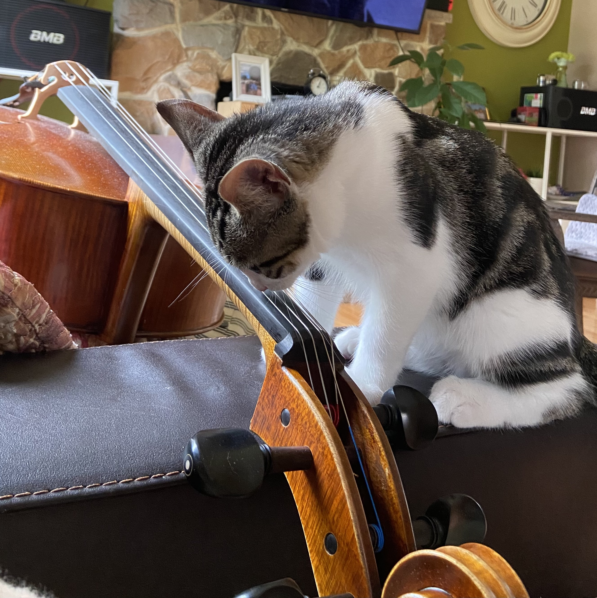
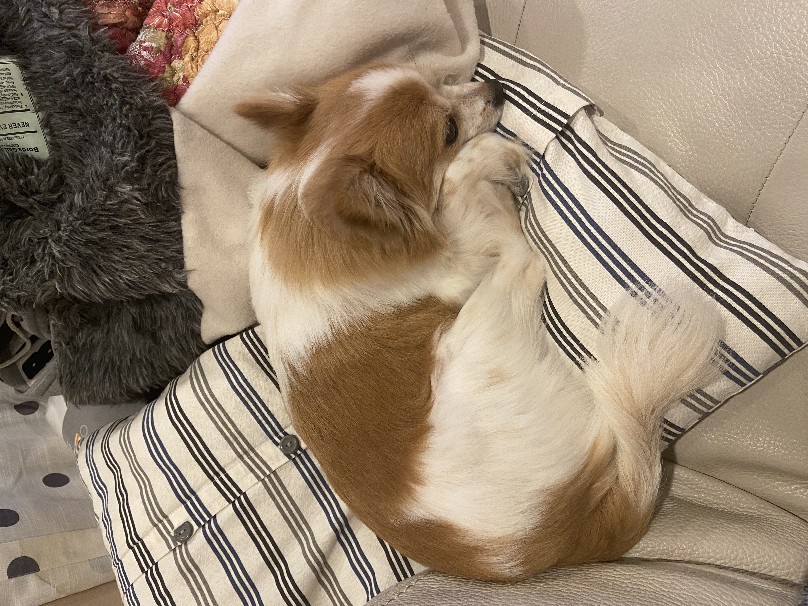
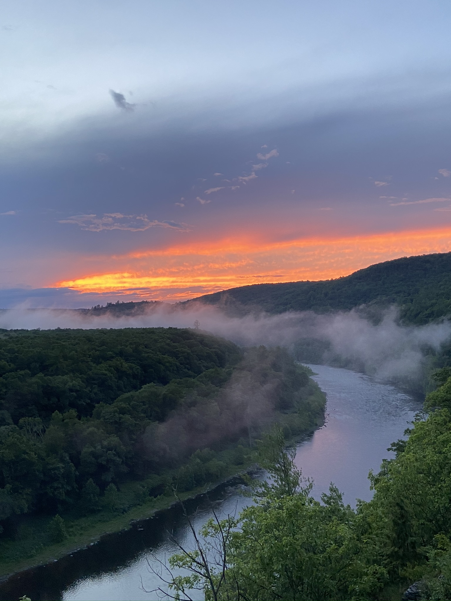

```{r setup, include=FALSE}
knitr::opts_chunk$set(echo = FALSE)
```

<center>

{width=70%}

</center>

## About me
I am currently a third-year student at Macalester College with an overarching goal of working toward equitable global healthcare systems by taking an interdisciplinary approach to public health and bridging the gap between quantitative analysis and the humanities to better understand the social and structural determinants of health. I am especially passionate about using academia as a vessel for social activism and looking at modern-day issues through a socioplitical lens.

In my free time, I love [playing the cello](https://youtu.be/yX1ljkBx5lI) -- I've been playing for almost 8 years now! My favorite part of playing has to be the collaborative aspect because I love making music with other people. Here's a [project](https://youtu.be/UG3OuXllCk4) I did with my friend Annie at the start of quarantine. I also enjoy watching movies and listening to music. My favorite albums at the moment are *Solar Power* by Lorde, *Devotion* by Beach House, and *Punisher* by Phoebe Bridgers. 

<center>

{width=60%}

{width=60%}

{width=60%}

</center>

## Education
BA candidate at Macalester College in Applied Math & Statistics and International Studies (Political Science disciplinary focus),
Community & Global Health Concentration

For more information about my professional interests and work experience, please read through my [resume](https://drive.google.com/file/d/1S6037rOGaKLhTZFipU2IROopexout93U/view?usp=sharing)!

## Contact
Please reach me at my school email, blee1@macalester.edu or through my personal email at briandlee01@gmail.com!
